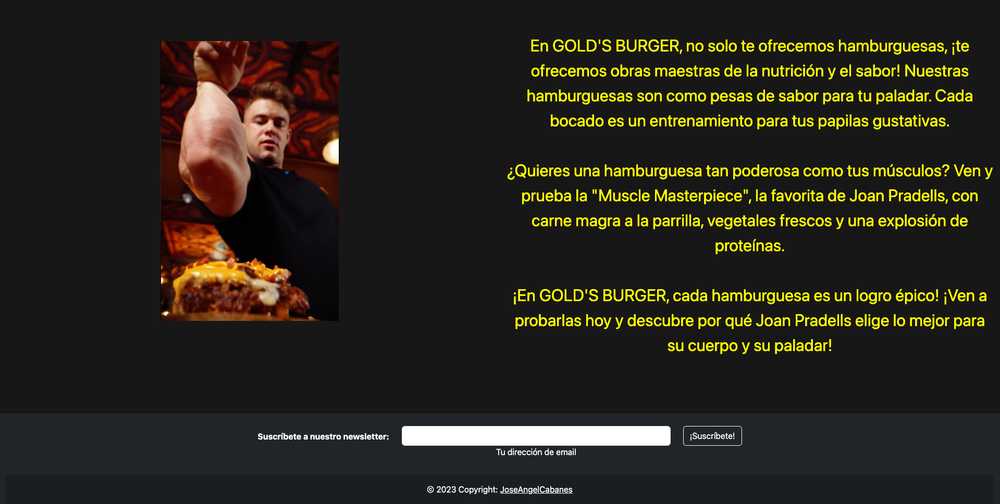

# fsdVAL0923Proyecto1
# Gold's Burger - Simulación de Restaurante de Hamburguesas

Bienvenido a Gold's Burger, tu restaurante de hamburguesas inspirado en los culturistas más famosos del mundo. Esta aplicación web te permite experimentar la deliciosa combinación de hamburguesas gourmet y la inspiración del culturismo en un solo lugar.

## Características principales

- **Menú Inspirado en Culturistas**: Nuestro menú presenta hamburguesas con nombres ingeniosos y juegos de palabras basados en culturistas famosos, lo que hace que tu experiencia gastronómica sea única y entretenida.

- **Accesibilidad en Línea**: Puedes explorar nuestro menú, consultar nuestra ubicación y formulario para poneros en contacto con nosotros.

- **Historia de los Culturistas**: Descubre datos interesantes sobre los culturistas famosos que inspiraron nuestras hamburguesas y conoce sus logros en el mundo del culturismo.

## Uso

1. **Prepárate desde nuestra página principal**: Encuentra una breve introducción y los apartados disponibles nada más accedar a la web.

2. **Explora el Menú**: Navega por nuestro menú virtual para ver todas las hamburguesas y platos inspirados en culturistas.

3. **Consulta donde nos encontramos y como contactarnos**: Selecciona una hamburguesa y personaliza los ingredientes según tus preferencias.

## Capturas de Pantalla

## Bugs Conocidos

- **Fallo del responsive**: La intención era hacerlo 100% responsive con cualquier dispositivo pero en los últimos cambios se han descuadrado y no he podido volver a cuadrarlo.

- **Fallo con declaraciones en .css**: El archivo .css no está todo lo correcto que debería ya que el orden de declaraciones puede ser confuso y hay algunas declaradas que no se están usando finalmente.

- **Información Nutricional**: Era un punto que me habría gustado abarcar: "Proporcionamos información detallada sobre el contenido nutricional de cada hamburguesa, para que puedas tomar decisiones informadas sobre tu comida."

## Contribuciones

Si deseas contribuir al desarrollo de Gold's Burger, te invitamos a abrir un [issue](https://github.com/JoseAngelCabanes/fsdVAL0923Proyecto1/issues) o enviar una [pull request](https://github.com/JoseAngelCabanes/fsdVAL0923Proyecto1/pulls) con tus mejoras o correcciones. ¡Estamos abiertos a colaboraciones!

## Licencia

Este proyecto está bajo la licencia [MIT License]. Puedes consultar el archivo `LICENSE.md` para obtener más detalles.

## Contacto

Si tienes alguna pregunta o comentario, no dudes en ponerte en contacto con nosotros en joseangelcabanes29@gmail.com o a través de mis redes sociales:

- [LinkedIn](https://www.linkedin.com/in/angel-cabanes/)
- [Github](https://github.com/JoseAngelCabanes)

¡Gracias por elegir Gold's Burger y disfruta de tus hamburguesas inspiradas en los campeones del culturismo!
